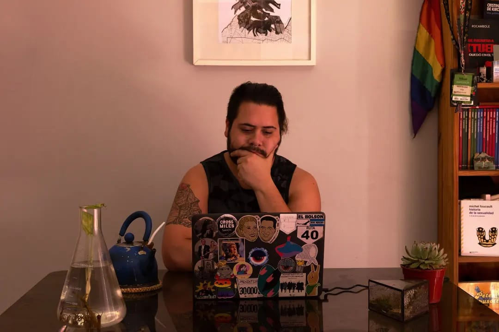

Presentación personal de
# Martín Balsamo

Hola mundo! Mi nombre es Martín. En este momento me encuentro cursando el segundo año de la **Tecnicatura en Programación** en la **Universidad Nacional de Hurlingham** con la intención de, una vez finalizada la tecnicatura, poder continuar con la _Licenciatura_. Después de un duro primer año programando en papel estoy muy contento y entusiasmado con las materias que estoy haciendo este cuatrimestre que son:
- Programación con objetos I
- Bases de datos
- Taller de marcado web.

Antes de llegar a la UNaHur hice gran parte de la **Licenciatrua en Ciencias Físicas** en la **UBA**, digo gran parte porque cursé toda la carrera y cuando estaba rindiendo mis últimos finales y comenzando la tesis estalló la pandemia. Esos meses de aislamiento me metí de lleno a aprender todo lo que pude sobre _aprendizaje automático_, aprovechando la fuerte base de matemática, análisis y estadística que me dio Física, enamorándome por completo del mundo de los datos y la inteligencia artificial.

A fines del 2021 comencé a trabajar como **Científico de Datos** en una consultora, para darme cuenta que sabía mucho de matemática, pero de programación **absolutamente nada**. Todo mi 2021 fue una contradicción entre estudiar materias de física para recibirme pero desencantado totalmente con esa carrera y el futuro en el cual me visualizaba, así que a fin de ese año decido abandonar esa carrera para seguir lo que realmente me gusta y me entusiasma que es la **Informática**.

Arranqué el 2022 con la idea de **fracaso** por haber dejado una carrera que me tomó tantos años, por empezar de nuevo, pero rápidamente la UNaHur me acogió y me sentí como en casa. Temía aburrirme en las primeras materias dado mi conocimiento previo pero los conceptos que fui aprendiendo fueron tan útiles que desde _introducción a la lógica_ pude empezar a aplicar las _buenas prácticas_ y los contenidos que iba aprendiendo a mi trabajo diario.

Hoy estoy muy contento con la decisión tomada, tengo la oportunidad de estar conociendo gente excelente y estar estudiando algo que me apasiona. Esta materia parece un gran desafío, pero si fuera fácil no sería divertido, así que les saludo lleno de entusiasmo.

Muchas gracias por leer! Nos vemos en la cursada.

~ Martín